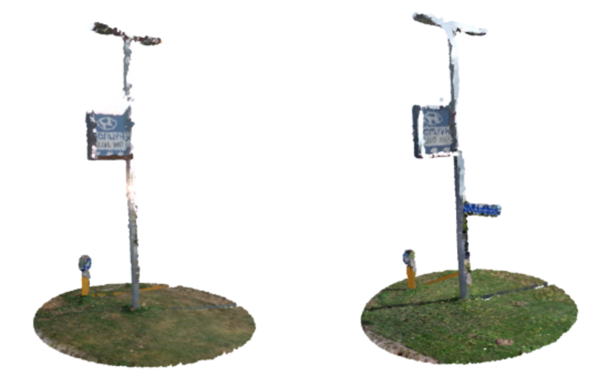
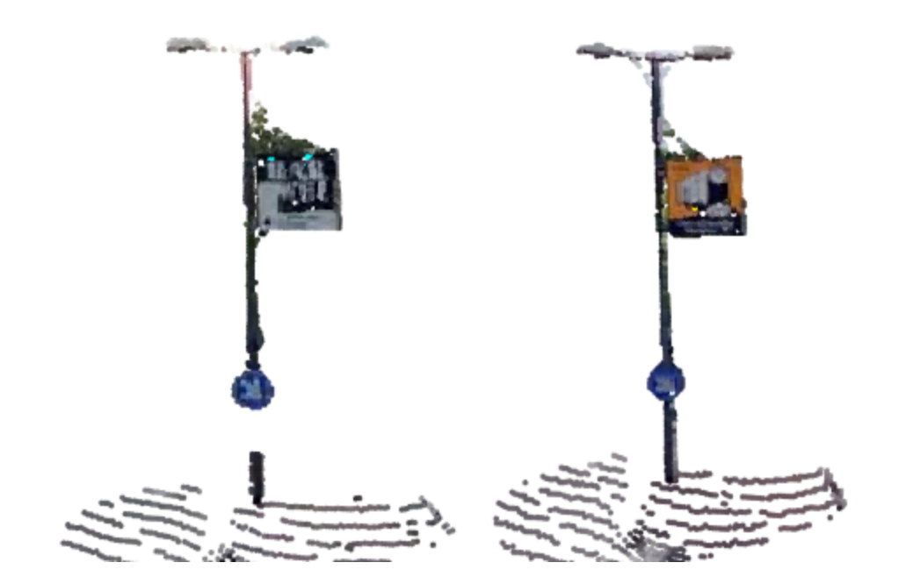
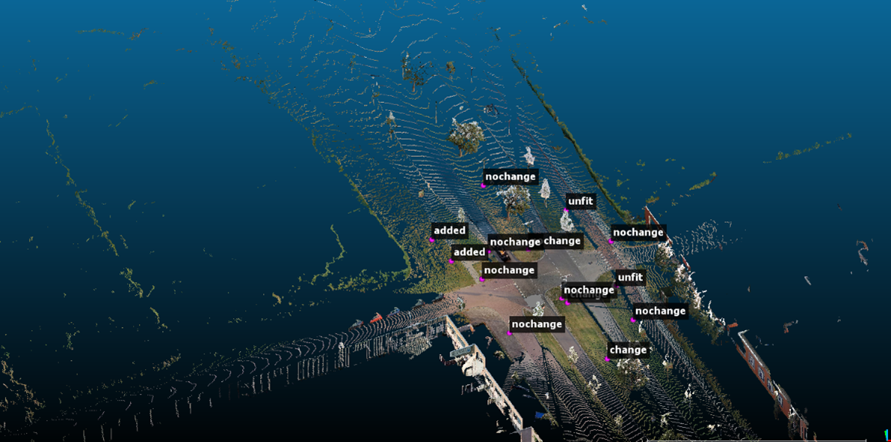

## Task
The rapid development of 3D acquisition devices enables us to collect billions of points in few hours. However, the analysis of the output data is a challenging task, especially in the field of 3D point cloud change detection. 

In this track, we provide large scale 3D point cloud pairs in two different years. Our goal is to detect the changes from multi-temporal point clouds in a complex street environment. We provide manually labelled ground-truth for training and validation. We expect to encourage researchers to try out different methods, including both deep learning and traditional techniques.

## Dataset

The data is provided by CycloMedia. The dataset consists of annotated "points of interest" in street level colored point clouds gathered in 2016 and 2020 in the city of Schiedam, Netherlands using vehicle mounted LiDAR sensors. The dataset focuses on street furniture, with the majority of labels corresponding to road-signs although other objects such as advertisements, statues and garbage bins are also included. Labeling was done through manual inspection.

We choose over 78 annotated street-scene 3D point cloud pairs in the year of 2016 and 2020. Each point cloud pair represents a street scene in two different years and contains a group of changed or unchanged objects. Each object pair is assigned one of the following labels:

(1) `Nochange` (2) `Removed` (3) `Added` (4) `Change` (5) `Color_change` 

To explain the labels:

`Nochange` refers to the case where there is no significant change between the two scans.

`Added` refers to objects that do not exist in the first scan but are added during the second scan, `Removed` is the opposite case.

`Change` refers to the case where there is at least significant geometric change but also includes cases where there is also significant change in the RGB space. This includes being replaced by other objects. For example in the following picture a small blue sign is added whilst the rest of the sign stays the same.



`Color_change` refers to the case where there is not significant geometric case but significant change in the RGB space. For example, in the following picture, content of an advertisement changed but the rest of the cloud is the same.




<!-- To explain the class labels, suppose we have a point cloud pair of time t1 and t2. Here, `Added` and `Removed` mean an object existed at time t1 but not at t2 and vice versa. `Color_change` refers to cases where change occurs only in color. `Change` refers to cases where an object is there but changed or replaced by a different object. -->

### Labeling Format

Each data point consists of the coordinate of a point of interest and the corresponding label.
The points have been placed on or at the base of the object. A first step for preparing the points for input to a model may be taking all points within a certain x-y radius of the point of interest (resulting cylinders as seen above) from both point clouds. In most cases, apart from the ground this will give a fairly clean representation of the object. There are though cases where this will include other objects (for example signs that are close together) or parts of trees that are above the object.

Corresponding point clouds are saved with file names starting with the same integer (the scene number). The classifications are saved in csv files which also start with the same scene number. The coordinates contained in the csv file correspond to the points of interest.

<!-- 
 -->


To fit for a learning system, the dataset is split into training and test sets with the ratio 80% and 20%.

### Viewing the dataset

The points and corresponding labels can be viewed in context by loading the classification csv and the corresponding cloud(s) in [CloudCompare](https://www.danielgm.net/cc/) software.

The following <image src="/assets/mark-github-512.webp" height="18"/> [tool](https://github.com/SamGalanakis/ChangeDetectionDatasetViewer) can be used to isolate, view these points of interest in a more convenient manner. A very similar tool was used to conduct the labeling. 


<!-- 
## Dataset statistics

A total of 78 scenes with varying numbers of points of interest are included in the dataset.

<table>
<tr> 
    <th> Labels </th>
    <th> Number </th>
</tr>
<tr> 
    <th> Nochange </th>
    <th> 441 </th>
</tr>
<tr> 
    <th> Removed </th>
    <th> 125 </th>
</tr>
<tr> 
    <th> Added </th>
    <th> 69 </th>
</tr>
<tr> 
    <th> Change </th>
    <th> 80 </th>
</tr>
<tr> 
    <th> Color_change </th>
    <th> 26 </th>
</tr>
</table>

| Labels | Number |
| ------- | ------- |
| Nochange | 441 |
| Removed | 125 |
| Added | 69 |
| Change | 80 |
| Color_change | 26 | -->


## Download

During the challenge period, only the train set is provided to the participants.

The full dataset is now available:
- [<b><span style="color:blue">Raw point clouds and train set</span></b>](https://drive.google.com/drive/folders/1SVc4fXt5sZBZgqu1ko7xmB9y383H6c9A?usp=sharing), 
- [<b><span style="color:blue">Test set</span></b>](https://drive.google.com/drive/folders/1qZvDq-n6qrrRSwa7OKinUiq3JzsHG50z?usp=sharing). 

If you are willing to use our data, please cite our [paper](https://www.sciencedirect.com/science/article/abs/pii/S0097849321001369).

```bib
@article{KU2021192,
title = {SHREC 2021: 3D point cloud change detection for street scenes},
journal = {Computers & Graphics},
volume = {99},
pages = {192-200},
year = {2021},
issn = {0097-8493},
doi = {https://doi.org/10.1016/j.cag.2021.07.004},
url = {https://www.sciencedirect.com/science/article/pii/S0097849321001369},
author = {Tao Ku and Sam Galanakis and Bas Boom and Remco C. Veltkamp and Darshan Bangera and Shankar Gangisetty and Nikolaos Stagakis and Gerasimos Arvanitis and Konstantinos Moustakas},
keywords = {SHREC 2021, 3D Point cloud change detection, Graph convolutional networks, Siamese networks},
}
```


## Registration

To participate in the track, please send us an email. In it, please confirm your interest in participation and mention your affiliation and possible co-authors. After filling out and submitting this  [terms of usage document](/assets/SHREC2021%20Terms%20of%20Use%20of%20CMT%20UU%20%20data.docx) to [shrec@cs.uu.nl](mailto:shrec@cs.uu.nl) and [t.ku@uu.nl](mailto:t.ku@uu.nl), you will get the credentials to download the dataset. 

## Submission

From participants, no later than the deadline mentioned in the schedule, we expect an executable program submitted along with a detailed description of the method (less than two pages). The program will be used to generate results on the private test set.

## Evaluation

The main goal of the track is to find change area and corresponding change labels. Global accuracy and per-class accuracy will be the main evaluation metrics.

<!-- For different classes, IoU (Intersection over Union) is one of the main evaluation metrics. For the whole dataset, the unweighted average of IoU (mIoU) of each class and global accuracy are import indicators. We set these three metrics as the main evaluation indicators. -->

## Schedule

The registration and submission deadlines are in AoE (Anywhere on Earth) timezone.

-	Jan 8, 2021: The dataset is available.

-	Feb 10, 2021: Registration deadline.

-	<p style="color: red">March 1, 2021: Submission deadline of the results.</p>

-	<p style="color: red">March 15, 2021: Track submission to SHREC for review.</p>

-	April 15, 2021: First reviews done, first stage decision on acceptance or rejection.

-	May 15, 2021: First revision due.

-	June 15, 2021: Second stage of reviews complete, decision on acceptance or rejection.

-	June 30, 2021: Final version submission.

-	July 5, 2021: Final decision on acceptance or rejection.

-	September, 2021: Publication online in Computers & Graphics journal.


## Organizers

- Tao Ku, Utrecht University, Department of Information and Computing Sciences.
- Sam Galanakis, Utrecht University, Department of Information and Computing Sciences.
- Bas Boom, Cyclomedia Technology.
- Remco C. Veltkamp, Utrecht University, Department of Information and Computing Sciences.

To contact the organizers, please send email to [t.ku@uu.nl](mailto:t.ku@uu.nl)


> CycloMedia develops, builds and operates the worlds most advanced mobile mapping systems. With a combination of sensors ranging from cameras and Lidar scanners to state-of-the-art positioning systems we map dense urban areas in Western Europe and North America. Point clouds and images are accurately geo-registered, where the panoramic imagery is of high geometric quality.
> The petabytes of data (all processed and stored in the Microsoft Azure cloud) that we collect every year are used by “professional users”, ranging from city governments to large corporates working in utilities, infrastructure and insurance. Their one common denominator is their need for better data and information to drive change in how they can serve their inhabitants and customers. Today our solutions make cities more safe, green, accessible and smart and help companies to make the right decisions based on fresh and accurate data. CycloMedia is based in The Netherlands and has offices in the US and Germany.

<!-- 

Write your biography here. Tell the world about yourself. Link to your favorite [subreddit](http://reddit.com){:target="\_blank"}. You can put a picture in, too. The code is already in, just name your picture `prof_pic.jpg` and put it in the `img/` folder.

Put your address / P.O. box / other info right below your picture. You can also disable any these elements by editing `profile` property of the YAML header of your `_pages/about.md`. Edit `_bibliography/papers.bib` and Jekyll will render your [publications page](/al-folio/publications/) automatically.

Link to your social media connections, too. This theme is set up to use [Font Awesome icons](http://fortawesome.github.io/Font-Awesome/){:target="\_blank"} and [Academicons](https://jpswalsh.github.io/academicons/){:target="\_blank"}, like the ones below. Add your Facebook, Twitter, LinkedIn, Google Scholar, or just disable all of them. -->
